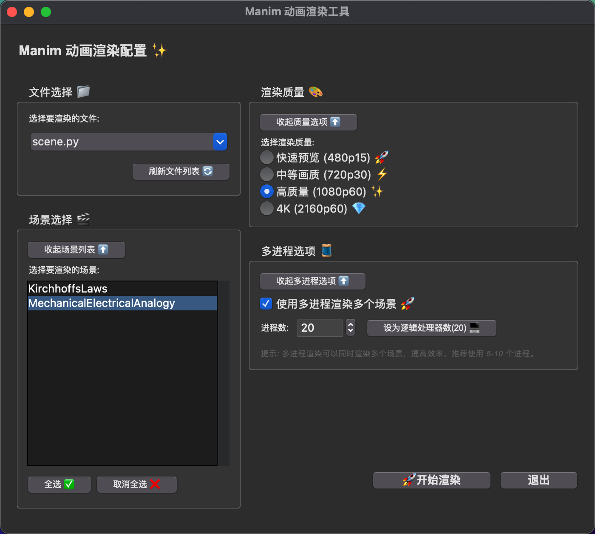
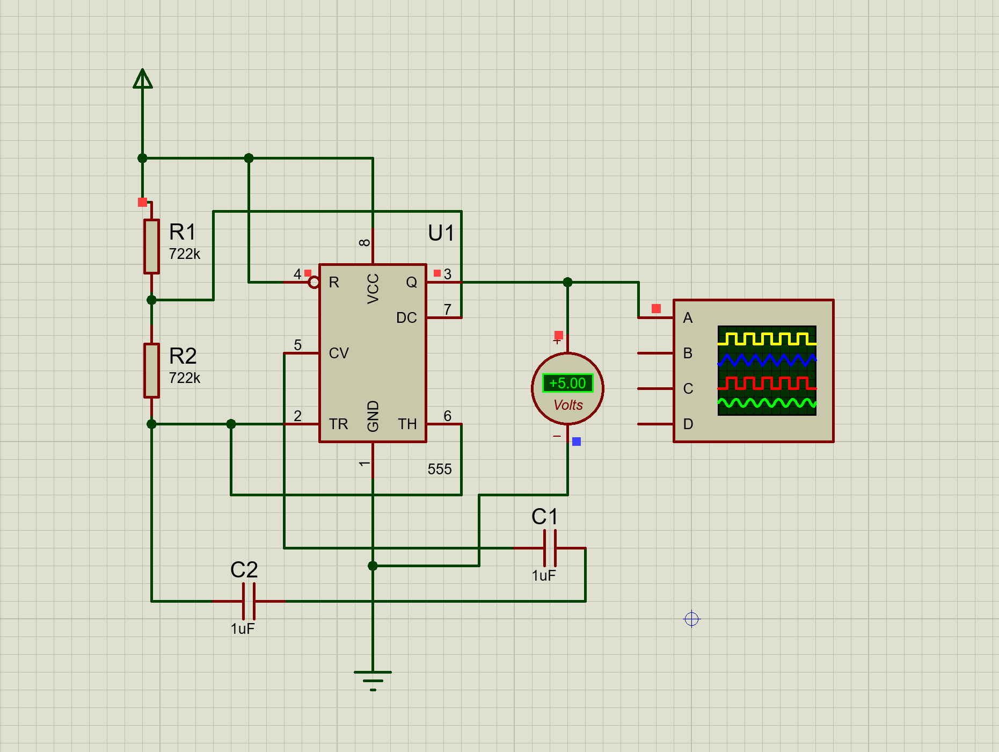

# 🔬 QEA2 | 电路及机械系统建模与时域响应分析 ⚡

## 🎬 Waya_Manim 实现 🎨

### 同时也是Manim工具集 🔩



### 📺 讲解视频在 B 站 🚀


🔗 B
站链接：[🎥 电路及机械系统建模与时域响应分析](https://www.bilibili.com/video/您的视频ID)
👈 点击观看完整视频！

### 📁 本地视频文件 💾

- ⬇️
  [下载高清视频](https://github.com/Wang-Yang-source/Manim_QEA2/raw/main/media/videos/scene/1080p60/KirchhoffsLaws.mp4)
  (1080p60)

## 📋 项目内容 📊

- ⚡ 基尔霍夫电流定律 (KCL) 与电压定律 (KVL)
- 🔋 电路元件：电容、电感、电阻
- 🧮 RLC 电路示例与分析
- 🔄 机械系统建模与分析
- 🔄 机械-电气系统对偶性


👈使用Proteus建模仿真，使用电路建模流程分析555定时器
⚡从零实现电路分析，公式推导，最后每秒闪烁一次

## 🛠️ 技术栈 💻

- 🐍 Python
- 🎞️ Manim 动画引擎
- 📊 数学建模

## 🚀 使用方法

1. 将 `run.py` 文件放在您的 Manim 项目目录中
2. 运行以下命令启动图形界面：

```bash
python run.py
```

3. 在图形界面中：
   - 选择要渲染的 Python 文件
   - 选择要渲染的场景（可多选）
   - 设置渲染质量
   - 配置多进程选项（推荐启用）
   - 点击"开始渲染"按钮

## 📋 界面说明

### 文件选择

选择包含 Manim 场景的 Python 文件。工具会自动扫描当前目录下的所有 `.py`
文件（除了 `run.py` 本身）。

### 场景选择

显示所选文件中的所有 Manim
场景。您可以选择一个或多个场景进行渲染。支持全选和取消全选操作。

### 渲染质量

提供四种预设的渲染质量选项：

- 快速预览 (480p15) - 适合快速测试
- 中等画质 (720p30) - 适合一般用途
- 高质量 (1080p60) - 适合最终作品
- 4K (2160p60) - 适合需要超高清晰度的场景

### 多进程选项

启用多进程渲染可以同时渲染多个场景，显著提高效率。您可以设置使用的进程数，建议设置为您计算机的逻辑处理器数量。

## 🔧 高级功能

### 命令行模式

除了图形界面外，该工具还支持命令行模式：

```bash
python run.py file.py Scene1 Scene2 -ql
```

命令行参数：

- 第一个参数：Python 文件名
- 后续参数：要渲染的场景名称（可指定多个）
- 质量选项：`-ql`（低质量）、`-qm`（中等质量）、`-qh`（高质量）、`-qk`（4K）

### 多进程渲染

在命令行模式下启用多进程渲染：

```bash
python run.py file.py Scene1 Scene2 -ql --parallel --workers 8
```

## 📝 注意事项

- 渲染过程中会显示实时进度和状态
- 渲染完成后会显示成功/失败的场景数量和总用时
- 渲染结果保存在 `media/videos/[文件名]/[分辨率]/` 目录下
- 如果渲染过程中出现错误，工具会显示详细的错误信息

## 🤝 贡献

欢迎提交问题报告、功能请求或代码贡献！

## 📜 许可证

MIT 许可证
